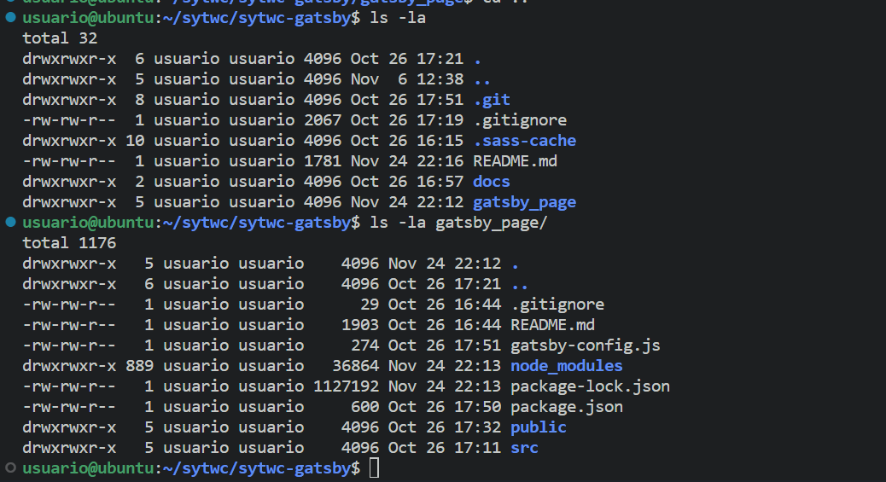
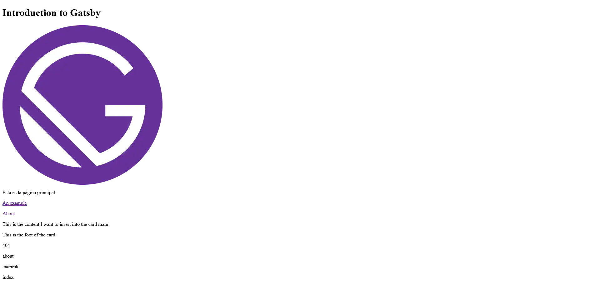
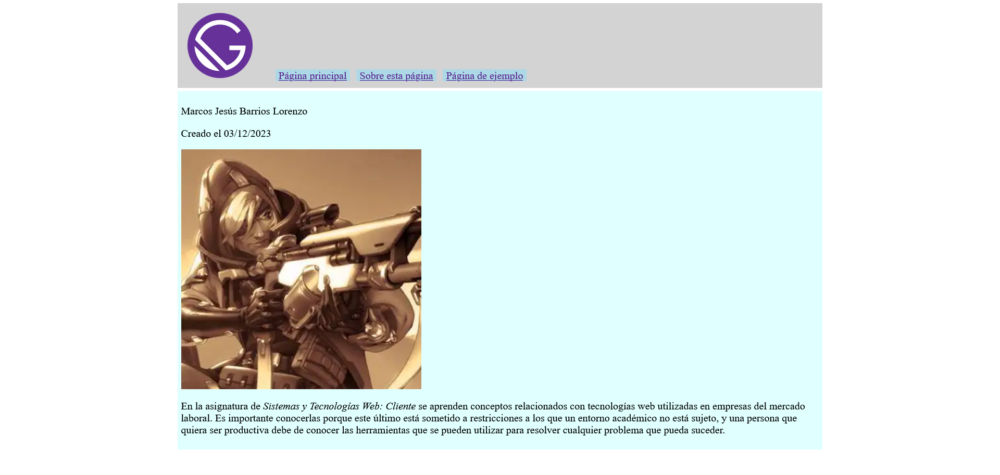
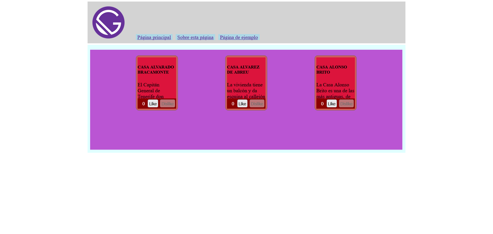
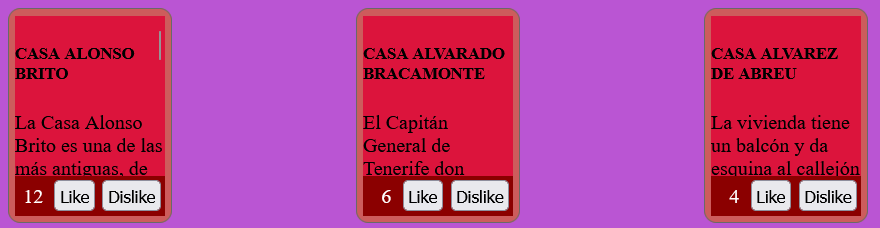
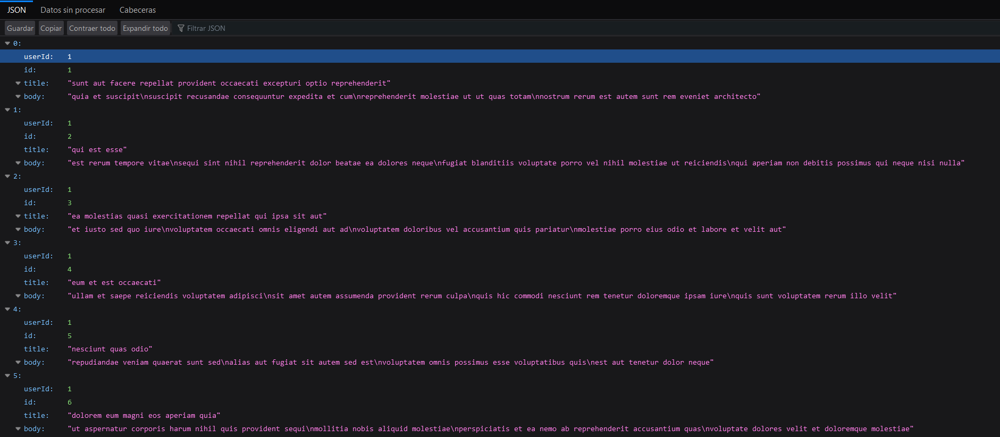

# SYTWC Sass Theory

Marcos Barrios, alu0101056944

## Índice
  
  - [Tareas](#tareas)
  - [Haciendo un Layout con encabezado y zona principal](#haciendo-un-layout-con-encabezado-y-zona-principal)
  - [Creación del componente edificio](#creacion-del-componente-edificio)
  - [Modificación de `Building` hacia separación de contenido y placeholders](#modificación-de-building-hacia-separación-de-contenido-y-placeholders)
  - [Obtención de datos desde API hacia nuevo componente `BuildingWithAPI`](#obtención-de-datos-desde-api-hacia-nuevo-componente-buildingwithapi)

## Tareas

### Tarea 1: Configurar el proyecto Gatsby

Se instala gatsby y se utiliza `gatsby new` para comenzar una nueva página web de gatsby con la estructura básica. A continuación se observa la estructura hasta la tarea 3 completada:

```bash
.
├── README.md
├── docs
└── gatsby_page
    ├── README.md
    ├── gatsby-config.js
    ├── package-lock.json
    ├── package.json
    ├── public
    │   ├── page-data
    │   │   ├── 404.html
    │   │   │   └── page-data.json
    │   │   ├── about
    │   │   │   └── page-data.json
    │   │   ├── dev-404-page
    │   │   │   └── page-data.json
    │   │   ├── example
    │   │   │   └── page-data.json
    │   │   └── index
    │   │       └── page-data.json
    │   ├── static
    │   └── ~partytown
    │       ├── debug
    │       │   ├── partytown-atomics.js
    │       │   ├── partytown-media.js
    │       │   ├── partytown-sandbox-sw.js
    │       │   ├── partytown-sw.js
    │       │   ├── partytown-ww-atomics.js
    │       │   ├── partytown-ww-sw.js
    │       │   └── partytown.js
    │       ├── partytown-atomics.js
    │       ├── partytown-media.js
    │       ├── partytown-sw.js
    │       └── partytown.js
    └── src
        ├── images
        │   └── icon.png
        ├── pages
        │   ├── 404.js
        │   ├── about.js
        │   ├── example.js
        │   └── index.js
        └── templates
            └── sometemplate.js
```

Solo está presente un repositorio. Se puede observar que solo hay una carpeta .git:



### Tarea 2: Página principal que enlaza a otras dos páginas

Página principal

 - [Enlace a la página principal escrito como componente react gatsby](gatsby_page/src/pages/index.js)

```js
const IndexPage = () => {
return (
  <div>
    <h1>Introduction to Gatsby</h1>
    <StaticImage src="../images/icon.png" alt="An image of a logo of gatsby"/>
    <p>Esta es la página principal.</p>
    <p><Link to="/example">An example</Link></p>
    <p><Link to="/about">About</Link></p>
    <SomeTemplate>
      <p>This is the content I want to insert into the card main</p>
    </SomeTemplate>
  </div>
)
}
```

 - [Enlace a la página de ejemplo escrito como componente react gatsby](gatsby_page/src/pages/example.js)


```js
 const Example = () => {
  return (
    <main>
      <h1>Introduction to Gatsby</h1>
      <p>Esta es la página example.</p>
      <SomeTemplate>
        <p>This is more content for the main part of my card component layout.</p>
      </SomeTemplate>
    </main>
  );
}
```

 - [Enlace a la página de "sobre esta página" escrito como componente react gatsby](gatsby_page/src/pages/example.js)

```js
const About = () => {
  return (
    <main>
      <h1>Introduction to Gatsby</h1>
      <p>Esta es otra página para cumplir el requerimiento de tener dos páginas enlazadas en otra.</p>
      <SomeTemplate>
        <p>This is a third use of the SomeTemplate layout.</p>
      </SomeTemplate>
    </main>
  )
}
```

### Tarea 3: Página principal que enlaza a otras dos páginas

El layout utilizado es el siguiente:

```js
const SomeTemplate = ({children}) => {
  return (
    <div>
      <div>
        {children}
      </div>
      <div>
        <p>This is the foot of the card</p>
      </div>
    </div>
  );
}
```

Se puede observar en [la tarea 2](#tarea-2-página-principal-que-enlaza-a-otras-dos-páginas) que las páginas web contienen la plantilla, utilizándola como `SomeTemplate`.

Este es el resultado final:

### Página principal


### Página de ejemplo


### Página de "sobre esta página"


### Tarea 4: Usar el componente `StaticImage`

Se instaló `gatsby-plugin-image` y se especificó en `gatsby-config.js` lo siguiente:

```js
module.exports = {
  siteMetadata: {
    title: `SYTWC Gatsby Assignment`,
    siteUrl: `https://www.yourdomain.tld`
  },
  plugins: [
    "gatsby-plugin-sass",
    "gatsby-plugin-image",
    "gatsby-plugin-sharp",
  ]
};
```

Es necesario instalar `gatsby-plugin-sharp` porque es una dependencia de `gatsby-plugin-image`. Se puede ver en las capturas de pantalla de la [tarea 3](#tarea-3-página-principal-que-enlaza-a-otras-dos-páginas) cómo se ve la imagen [Imagen del logo de gatsby](images/icon.png). En la [tarea 2](#tarea-2-página-principal-que-enlaza-a-otras-dos-páginas) están los fragmentos de código donde se ve como se utiliza el componente `StaticImage`.

## Usando GraphQL

Tras haber instalado el plugin `gatsby-source-filesystem`, se configura en gatsby.config.js:

```js
    {
      resolve: 'gatsby-source-filesystem',
      options: {
        name: 'all page components',
        path: `${__dirname}/src/pages`
      }
    }
```

Luego se agrega la siguiente consulta a [gatsby_page/src/pages/index.js](gatsby_page/src/pages/index.js):

```js
export const query = graphql`
query {
  allFile {
    nodes {
      name
    }
  }
}
`
```

Y se utiliza en el cuerpo del componente:

```js
  // (...)
  {
    data.allFile.nodes.map((node) => {
          return <p key={node.name}>{node.name}</p>
        })
  }
  // (...)
```

El resultado es:



## Haciendo un Layout con encabezado y zona principal

Se instala `node-sass` y el plugin `gatsby-plugin-sass`. Se configura el plugin `gatsby-config.js`.

Se define el template siguiente:

```js
const PageBody = ({navigationMenus, children}) => {
  return (
    <>
      <nav>
        {navigationMenus}
      </nav>
      <main>
        {children}
      </main>
    </>
  )
}
```

Que incluye una etiqueta html `nav` y otra `main`. Para permitir tener más de un menú, recibe un prop `navigationMenus`.

Luego se define otro template que use `PageBody` pero que pase por props información para el menú de navegación:

```js
const PageBodyAdvanced = ({children}) => {
  return (
      <PageBody 
        navigationMenus={
            [
              <NavigationMenuWithLogo
                logoImage={<StaticImage src="../images/icon.png" alt="The logo of the webpage"/>}
                links={
                  [
                    { to: '/', text: 'Página principal' },
                    { to: '/about', text: 'Sobre esta página' },
                    { to: '/example', text: 'Página de ejemplo' }
                  ]
                }
              />
            ]
          }>

        {children}
      </PageBody>
  )
}
```

El template `PageBodyAdvanced` pasa por el prop `links` al template propio `NavigationMenuWithLogo` información para crear enlaces hacia las páginas `/`, `/about` y `/example`, además de un logo que utiliza `StaticImage` del plugin `gatsby-plugin-image` por el prop `logoImage`.

La definición del template `NavigationWithMenuLogo` es la siguiente:

```js
const NavigationMenuWithLogo = ({logoImage, links}) => {
  // **Aquí se comprueba que el tipo del prop links es adecuado**

  return (
    <div class="navigationFlexboxLayout">
      <div class="logoDiv">
        {logoImage}
      </div>
      {
        links.map((linkInfo, index) => (
              <Link className="simpleLink" key={index} to={linkInfo.to}>{linkInfo.text}</Link>
            ))
      }
    </div>
  );
}
```

Una vez creados esos templates `PageBody`, `PageBodyAdvanced`, `NavigationMenuWithLogo` se defined las tres páginas:

### `pages/index.js`

```js
const IndexPage = () => {
  return (
    <div>
      <PageBodyAdvanced>
        <p>El contenido de la plantilla de contenido se puede observar aquí.</p>
      </PageBodyAdvanced>
    </div>
  )
}
```

### `pages/example.js`

```js
const Example = () => {
  return (
    <PageBodyAdvanced>
      <p>Example webpage.</p>
    </PageBodyAdvanced>
  );
}
```

### `pages/about.js`

```js
const About = () => {
  return (
    <PageBodyAdvanced>
      <p>Marcos Jesús Barrios Lorenzo</p>
      <p>Creado el 03/12/2023</p>
      <StaticImage src="../images/author-picture.jpg" alt="Author image taken from it's github account"/>
      <p>En la asignatura de <em>Sistemas y Tecnologías Web: Cliente</em> se aprenden conceptos
      relacionados con tecnologías web utilizadas en empresas del mercado laboral. Es importante
      conocerlas porque este último está sometido a restricciones a los que un entorno académico
      no está sujeto, y una persona que quiera ser productiva debe de conocer las herramientas
      que se pueden utilizar para resolver cualquier problema que pueda suceder.</p>
    </PageBodyAdvanced>
  )
}
```

Se puede observar como se ha incluido la información en `About` especificada en el enunciado de la práctica.

### Estilos scss

Se hace un `import from '../styles/<archivo>.scss'` en el archivo de cada componente template, de forma que se incluyen globalmente los estilos necesarios para la página web.

#### `styles/navigation-menu-with-logo.scss`

```css
@import './simple-navigation-menu.scss';

.navigationFlexboxLayout {
  display: flex;
  align-items: flex-end;

  %allItems {
    margin: 5px 5px 5px 5px;
    padding: 5px 5px 5px 5px;
  }

  .logoDiv {
    @extend %allItems;
    width: 100px;
    height: 100px;
    margin-right: 25px;
  }
}

```

Se utiliza el scss de `./simple-navigation-menu.scss` porque previamente se utilizaba un template `SimpleNavigationMenu` en vez del template `NavigationMenuWithLogo` y se quizo reutilizar sus contenido.

Contenido de `./simple-navigation-menu.scss`:

```css
.simpleLink {
  background-color: lightblue;
  margin: 5px 5px 5px 5px;
  padding: 0px 5px 0px 5px;
}
```

#### `styles/pagebody.scss`

```css
@mixin setMarginAndPadding {
  margin: 5px 5px 5px 5px;
  padding: 5px 5px 5px 5px;
}

main {
  background-color: lightcyan;
  @include setMarginAndPadding;
}

body {
  margin: auto;
  width: 1000px;
}

nav {
  background-color: lightgray;
  @include setMarginAndPadding;
}
```

### Resultado final:



### Creación del componente edificio

Se crean seis componentes `Card`, `Placeholder`, `Building`, `UserScore`, `CardWithScore`. El primero tiene un cuerpo y un pie en el que se espera que se introduzca cualquier contenido. En el segundo se espera que siga la mecánica de traspasar su contenido de un placeholder a otro. El tercero es un contenedor de placeholders con puntuaciones para cada contenido de placeholder, y es el que se encargará de renderizar el contenido en el placeholder correspondiente según su puntuación. `UserScore` es un `<span>` y dos `<button>` que representan una puntuación a la que se le puede dar like y dislike. Finalmente, `CardWithScore` devuelve una `Card` a la cual le pasa el componente `UserScore` y define props específicos de puntuación e índice dentro del edificio.

#### `Card`

```js
const Card = ({footContent, children}) => {
  return (
    <>
      <div className="card">
        <div className="card-main">
          {children}
        </div>

        <div className="card-foot">
          {footContent}
        </div>
      </div>
    </>
  )
}
```
Define la estructura de una carta; parte principal y pie de carta.

#### `Placeholder`

```js
const Placeholder = ({children}) => {
  return (
    <div className="placeholder">
      {children}
    </div>
  )
}
```

Es un simple div.

#### `Building`

```js
// (...)

import goods from '../../../content/bienes.json';

const Building = ({amountOfPlaceholders = 0}) => {
  const [allScore, setAllScore] =
      React.useState(new Array(goods.bienes.length).fill(0));
  const [allContent, setAllContent] =
      React.useState(
          goods.bienes
              .map((bien) => {
                  return (
                      <>
                        <h5>{bien.nombre}</h5>
                        <p>{bien.antecedentes}</p>
                        <p>Tipo: {bien.tipo.arquitectura}</p>
                        <p>Época: {bien.tipo.época}</p>
                        <p>Localización: {
                              `lat ${bien.localizacion.lat}, long: ${bien.localizacion.long}`
                            }
                        </p>
                      </>
                    )
                })
          );

  return (
    <div className="placeholders">
      {
       allContent
          .reduce((allPlaceholder, content, index) => {
              if (allPlaceholder.length < amountOfPlaceholders) {
                const sort = () => {
                  const allCombined =
                      allScore.map((score, index) => {
                            return {
                                score,
                                element: allContent[index],
                              }
                          });
                  const allSorted =
                      [...allCombined.sort((a, b) => b.score - a.score)];
                  setAllContent([...allSorted.map(_ => _.element)]);
                  setAllScore([...allSorted.map(_ => _.score)]);
                }
                const increaseScore = (index) => {
                  allScore[index]++;
                  sort();
                }
                const decreaseScore = (index) => {
                  if (allScore[index] >= 1) {
                    allScore[index]--;
                    sort();
                  }
                }
                allPlaceholder.push((
                    <Placeholder
                        key={`placeholder-${allPlaceholder.length}`}>
                      <CardWithScore
                          onIncreaseScore={increaseScore}
                          onDecreaseScore={decreaseScore}
                          index={index}
                          score={allScore[index]}>
                        {content}
                      </CardWithScore>
                    </Placeholder>
                  ));
              }
              return allPlaceholder;
            }, [])
      }
    </div>
  )
}
```

Dos variables de estado `allScore` y `allContent` definen arrays para puntuaciones y para el contenido que estará en cada placeholder. Hay tantos como bienes estén en el archivo `bienes.json` importado. El primero se inicializa todo a 0, el segundo se inicializa a un componente JSX con varios `<span>` que describen el bien.

El componente en si crea hasta `amountOfPlaceholders` placeholders. Cada uno contiene una carta con puntuación a la que se le pasan funciones `onIncreaseScore` y `onDecreaseScore` que son llamadas cuando el usuario presiona el botón de like o de dislike. Como cada contenido tiene asignado un index, se sabe qué contenido ha sido presionado y se actualiza el estado del componente `Building` acorde a ello.

#### `CardWithScore`

```js
const CardWithScore = ({footContent, children, onIncreaseScore, onDecreaseScore,
    index, score = 0}) => {
  return (
    <Card footContent={(
          <>
            <UserScore onIncreaseScore={() => onIncreaseScore(index)}
                onDecreaseScore={() => onDecreaseScore(index)}
                score={score}/>
            {footContent}
          </>
        )}>
      {children}
    </Card>
  )
}
```

La carta que contiene el sistema de puntuaciones y su contenido. Gestiona la puntuación pasándole la información adecuada al componente `UserScore`.

#### `UserScore`

```js
const UserScore = ({score, onIncreaseScore, onDecreaseScore}) => {
  const likeButton = React.useRef(null);
  const dislikeButton = React.useRef(null);
  const scoreSpan = React.useRef(null);

  React.useEffect(() => {
        if (score < 1) {
          dislikeButton.current.disabled = true;
        } else {
          dislikeButton.current.disabled = false;
        }

        scoreSpan.current.textContent = `${score}`;
      }, [score]);

  return (
    <>
      <span ref={scoreSpan}>{score}</span>
      <button ref={likeButton} onClick={onIncreaseScore}>Like</button>
      <button ref={dislikeButton} onClick={onDecreaseScore}>Dislike</button>
    </>
  )
}
```

Utiliza `useRef` para poder referenciar directamente los nodos DOM y define un `useEffect` para que cada vez que cambie el prop `score` se actualice el texto y el botón de dislike si llega a 0 su valor.

#### Resultado final



Se puede presionar los distintos botones y el orden del contenido cambiará:



### Obtención de datos desde API hacia nuevo componente `BuildingWithAPI`

#### Desacoplar el contenido del componente `Building`

En primer lugar se hacen cambios en `Building` para separar el contenido del componente. Para ello se introduce un prop `content` que representa el array de contenido que es pasado por una función `contentTransform` para transformar el contenido en un JSX. De esta forma el contenido se especifica al usar el componente:

```js
const IndexPage = () => {
  // Función que recibe como argumento cada element del array de "content"
  const contentTransform = (bien) => {
      return (
          <>
            <h5>{bien.nombre}</h5>
            <p>{bien.antecedentes}</p>
            <p>Tipo: {bien.tipo.arquitectura}</p>
            <p>Época: {bien.tipo.época}</p>
            <p>Localización: {
                  `lat ${bien.localizacion.lat}, long: ${bien.localizacion.long}`
                }
            </p>
          </>
        )
      }
  return (
    <>
      <PageBodyAdvanced>
        <h3>Usos del componente edificio</h3>
        <h4>Con datos obtenidos de archivo .json:</h4>
        <Building amountOfPlaceholders={5} content={goods.bienes} // se le pasa tanto content como contentTransform
            contentTransform={contentTransform}/>
        <h4>Con datos de API</h4>
        <BuildingWithAPI amountOfPlaceholders={10}></BuildingWithAPI>
      </PageBodyAdvanced>
    </>
  )
}
```

#### Crear el componente `BuildingWithAPI`

Utilizando [https://jsonplaceholder.typicode.com/posts](https://jsonplaceholder.typicode.com/posts) como contenido, debe obtener el título y el body que tiene cada elemento en una consulta de graphql. `allRecords` viene de la configuración del plugin `gatsby-source-apiserver`.

```js
    // (gatsby-config.js)
    {
      resolve: 'gatsby-source-apiserver',
      options: {
        name: 'records',
        url: 'https://jsonplaceholder.typicode.com/posts',
        schemaType: apiContentSchema,
        enableDevRefresh: true,
      }
    }
```



```js
const BuildingWithAPI = ({amountOfPlaceholders = 0}) => {
    const data = useStaticQuery(graphql`
        query {
          allRecords {
            nodes {
              title
              body
            }
          }
        }
      `);

  const contentTransform = (content) => {
        return (
          <>
            <h5>{content.title}</h5>
            <p>{content.body}</p>
          </>
        )
      }

  return (
      <Building amountOfPlaceholders={amountOfPlaceholders}
          contentTransform={contentTransform}
          content={data.allRecords.nodes}/>
    )
}
```


>>>>>>> develop
